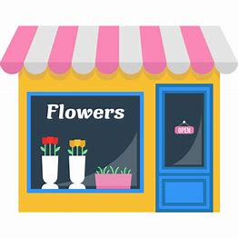
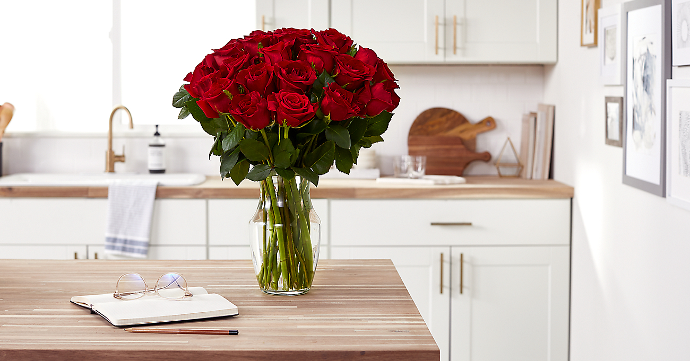
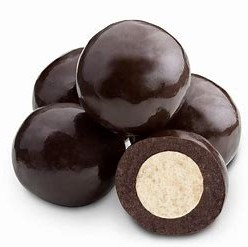
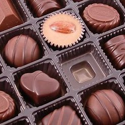
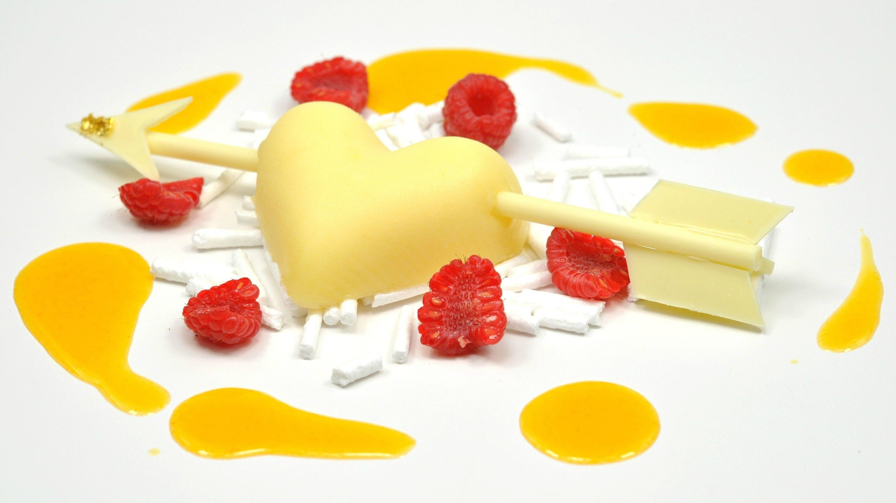

# NIIT_Flower-Shop_HTML5
from NIIT 2019

<html>

<head>
    <link rel="shortcut icon" href="images/home/yes.ico">
    <title>Home</title>
    
    
    
    
    
    <link rel="stylesheet" href="css/box.css">
    <link rel="stylesheet" href="css/cart.css">
</head>

<body>
    <header>
        <h3 style="font-size: 21px;color: yellowgreen; position: fixed; margin-top: 26px">
            
            Welcome To</h3>
        
        <h1>Countrywideflower.inc</h1>
        
        

            
        
            

                   
                

                

                    <Strong class="Cart_total_title">Total:</Strong>
                    $0
                

                 
                <button class="btn btn_primary btn_purchase" id="button-purchase" type="button" style="margin-left: -0px">PURCHASE</button>
                

            

            

            
    </header>

    

        
    

    

        
    

    

        

            <ul>
                <li style="background:url('images/home/5.jpg')">
                    
                    
                </li>
                <li style="background:url('images/home/1.jpg')">
                    
                    
                </li>
                <li style="background:url('images/home/2.jpg')">
                    
                    
                </li>
                <li style="background:url('images/home/3.jpg')">
                    
                    
                </li>
                <li style="background:url('images/home/4.jpg')">
                    
                    
                </li>
            </ul>
        

    

    <ul id="menu">
        <li class="st"><a href="" id="home">Home Page</a>
        </li>
        <li class="st"><a href="">Best seller Flower</a>
            <ul>
                <li>Lily</li>
                <li>KNX</li>
                <li>Just show all</li>
            </ul>
        </li>

        <li class="st"><a href="">Occasions</a>
            <ul>
                <li>New Year</li>
                <li>Birthday</li>
                <li>Love520</li>
            </ul>
        </li>
        <li class="st"><a href="">Hampers</a>
            <ul>
                <li><a href="Cakes.html">Cakes</a></li>
                <li><a href="Cards.html">Cards</a></li>
                <li><a href="Chocolate.html">Chocolate</a></li>

            </ul>
        </li>
        <li class="st"><a href="">Shopping carts</a>
            <ul>
                <li>What's in</li>
                <li>To pay</li>
                <li>To manage</li>
            </ul>
        </li>
        <li class="st"><a href="">Other services</a>
            <ul>
                <li><a href="Feedback.html">Customer service</a></li>
                <li>Logistic information</li>
                <li>B2B</li>
            </ul>
        </li>
    </ul>
    

    

    <body onload="checkLogin()" id="jer">

        

            

                ROSE couples
                
                

                    $31.9
                    <button type="submit" id="b12" class="btn btn-primary shop-item-button">Add to Kart</button>
                

            

            

                Pink rose
                
                

                    $30.9
                    <button type="submit" id="b12" class="btn btn-primary shop-item-button">Add to Kart</button>
                

            

            

                R&K:For bestie
                
                

                     $21.9
                    <button type="submit" id="b12" class="btn btn-primary shop-item-button">Add to Kart</button>
                

            

            

                K.N.X:For parents
                
                

                    $30.2
                    <button type="submit" id="b12" class="btn btn-primary shop-item-button">Add to Kart</button>
                

            

            

                Flower chocolate
                
                

                    $17.9
                    <button type="submit" id="b12" class="btn btn-primary shop-item-button">Add to Kart</button>
                

            

            

                Spherical
                
                

                    $15.9
                    <button type="submit" id="b12" class="btn btn-primary shop-item-button">Add to Kart</button>
                

            

            

                Box-packed
                
                

                    $31.9
                    <button type="submit" id="b12" class="btn btn-primary shop-item-button">Add to Kart</button>
                

            

            

                Happy Birthday
                
                

                    $1.6
                    <button type="submit" id="b12" class="btn btn-primary shop-item-button">Add to Kart</button>
                

            

            

                Anniversary
                
                

                    $2.5
                    <button type="submit" id="b12" class="btn btn-primary shop-item-button">Add to Kart</button>
                

            

            

                Spring Festival
                
                

                    $3.6
                    <button type="submit" id="b12" class="btn btn-primary shop-item-button">Add to Kart</button>
                

            

            

                Princess Crown
                
                

                    $45.9
                    <button type="submit" id="b12" class="btn btn-primary shop-item-button">Add to Kart</button>
                

            

            

                An arrow
                
                

                    $39.9
                    <button type="submit" id="b12" class="btn btn-primary shop-item-button">Add to Kart</button>
                

            

        

    </body>

                            

    <footer>
        

            

                
© 2019 Countrywideflower.inc All Rights Reserved.

            

            

               
                
                
Telephone Number:
                    65256863

            

            

                
                
Address: #16 Wencui
                    Ningxia
                    University

            

            

                
                
QQ: 2019666

            

            

                
                
Wechat：Countrywideflower121

            

        

    </footer>
    
    
         
</body>

</html>
